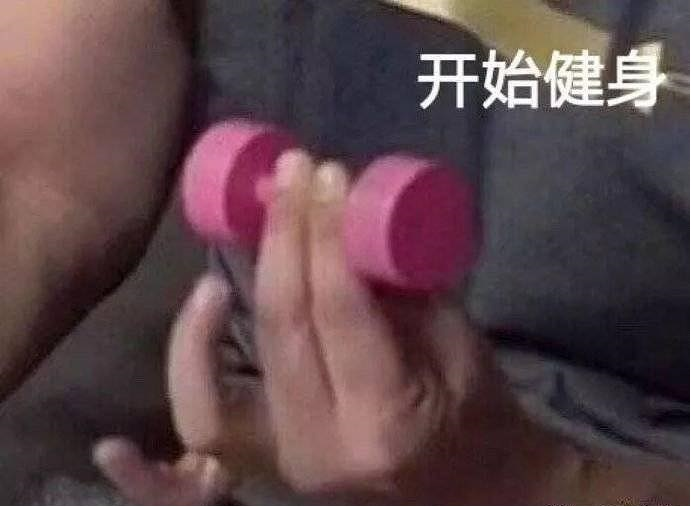

# Welcome to Yingqi's Organization

Hi There! It's me Yingqi Huang.

This is me:

I have a lot of hobbies.

such as:

- Travelling

- Playing mah-jong

- Workout

I have a master'degree in civil engineering. 

But now I decided to start learning programming, because it's much more interesting.

I hope I can become a good software developer in the future. 

